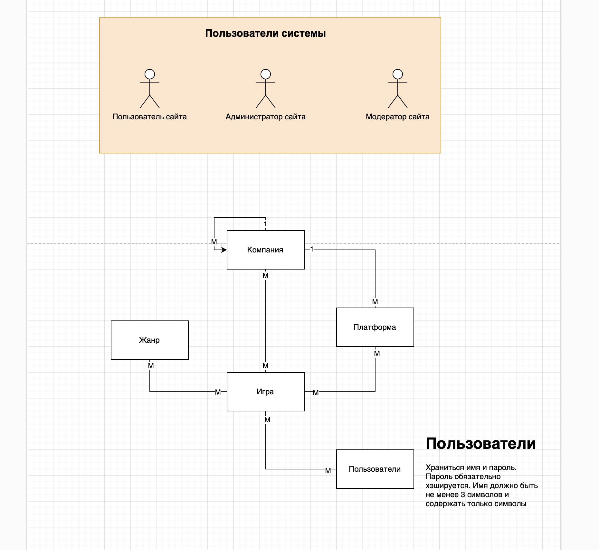

# Лабораторная работа №5

Схему можно строить, где удобно. Предлагаю: https://app.diagrams.net

## Задание

1. Самостоятельно выберете предметную область или выберете из предложенных:

- Онлайн магазин
- Банковское дело
- Туризм и путешествия
- Здравоохранение
- Образование и учебные заведения
- Ресторанное дело
- Социальные сети
- Автомобильная промышленность
- Логистика и снабжение
- Фитнес и спорт
- Недвижимость и аренда жилья
- Телекоммуникации

2. Изучить выбранную предметную область.
3. Определить основные сущности, которые присутствуют в выбранной предметной области.
4. Определить связи между основными сущностями в выбранной предметной области.
5. Определить основных пользователей БД.
6. Определить основные ограничения целостности для ряда определенных сущностей.
7. На основе проведенного анализа составить модель предметной области.

## Пример

