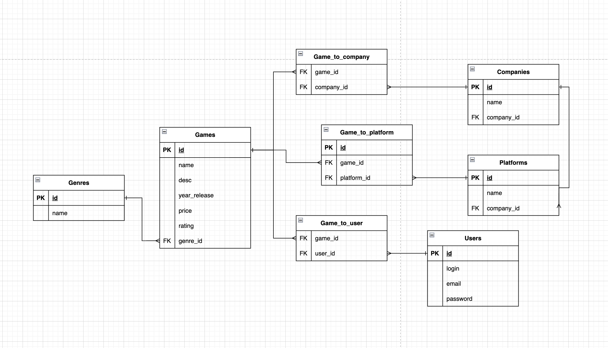

# Лабораторная работа №6

Схему можно строить, где удобно. Предлагаю: https://app.diagrams.net

## Задание

Создать на основе новой инфологической модели или, взятой с прошлой лабораторной работы, датологическую модель базы данных. Кратко описать базу данных: для чего нужна, какие таблицы имеются, что в этих таблицах хранится, описание полей таблицы

## Пример

